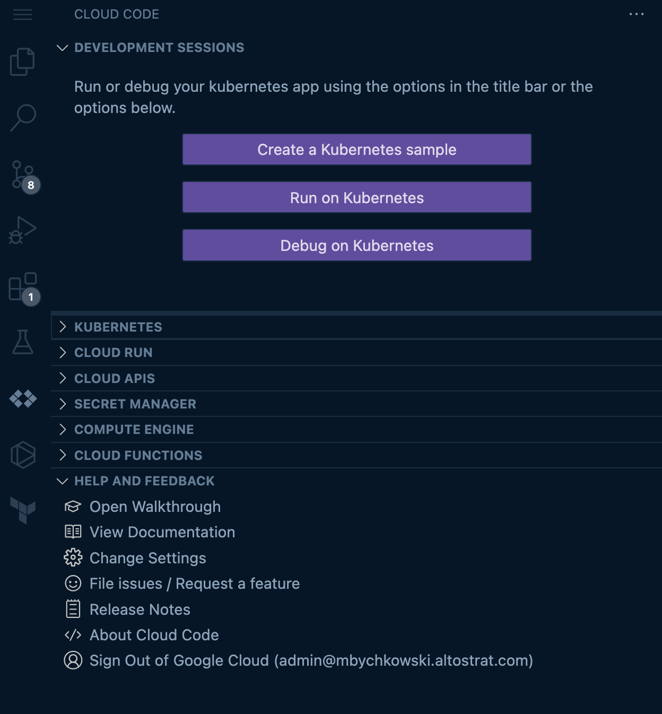

# Local Developement Lifecycyle & CI/CD Demo

This repository touches on the following services from Google Cloud and Open
Source.

**Google Cloud**
- Cloud Code
- Cloud Build
- Pub/Sub
- Artifact Registry
- Cloud Deploy
- ASM (traffic splitting)

**Open Source**
- Skaffold
- Kustomize
- Helm (TODO)

>This is not an officially supported Google repository.  All code and assets
>provided in this repo are made available on an as-is basis and the end user is
>responsible for all of their own security, scaling, and cost control as part of
>this deployment.

## Prerequisites

1. 2 gke zonal clusters. One designated as `dev` and a second as `prod`. For `prod` to
have canary releases, install ASM on `prod` cluster. Instructions [here](https://cloud.google.com/service-mesh/docs/managed/provision-managed-anthos-service-mesh) for installing ASM with Fleet API.

You can use the following command once your `prod` cluster is running to install
ASM with the Fleet API.

```
make asm-enable
```

## 00 - Initialize

For demonstration purposes it is recommended to set this code up in a
[Cloud Source Repository](https://source.cloud.google.com/) in your Goolge Cloud
project. Push this repository to that git repo once setup. CSR will be the
source of the build triggers for this demo.

**ENV Variables**

Define or source environment variables in terminal.

```
export REGION=us-central1             # e.g. us-central1
export ARTIFACT_REPO_NAME="cicd"      # e.g. "cicd"
export CSR_REPO_NAME="cicd-simple"    # e.g. "cicd-simple"

export CLUSTER_DEV_NAME=gke-dev       # change as needed
export CLUSTER_DEV_LOC=us-central1-c  # change as needed

export CLUSTER_PROD_NAME=gke-prod-asm # change as needed
export CLUSTER_PROD_LOC=us-central1-c # change as needed
```

Run the following script to populate templated `.yaml` configs with your `.env`
values.

```
sh ./scripts/source-env.sh
```

If at anytime you're running into trouble with IAM issues or APIs not enabled
run the following commands:

```
make enable-apis
make enable-iam
```

You can also check out the `Makefile` in the root directly to run the commands
without Make.

## 01 - Create Artifact Registry

We will create a "dirty" Artifact Registry and a "clean" registry. The "dirty"
registry will be for all of our local builds and development and the "clean"
registry will be for anything pushed to the deployment pipeline.

Create the dirty Artifact Registry with `Makefile`:

```
make registry-dirty
```

and clean registry:

```
make registry
```

Verify successful creation:

```
gcloud artifacts repositories list
```

Output should include our new registries: `$ARTIFACT_REPO_NAME` and
`$ARTIFACT_REPO_NAME-dirty`.

The "dirty" registry will tag the images in the format
`dev_"2006-01-02_15-04-05.999_MST"` that can be viewed in the `skaffol.yaml` in
`apps/backend00/skaffold.yaml` directory.

## 02 - Cloud Build triggers

Create the Cloud Build triggers for our backend app, `backend00`. To create
trigger based on `push` to `Main` branch:

```
make build-trigger-main
```

To create a trigger based on a release via a `tag` with the name `v*` run:

```
make build-trigger-tag
```

To create a trigger based on a pub/sub topic for Artifact Registry. This will
trigger pipeline based off a new image tag from Artifact Registry. **Note
`cloudbuild.yaml` not yet configured to run for this trigger**

```
make build-trigger-pubsub
```

View triggers in the [console](https://console.cloud.google.com/cloud-build/triggers;region=us-central1). Make sure you are on the correct region.

## 03 - Cloud Code

Make sure you have [Cloud Code](https://cloud.google.com/code/docs/vscode/install)
installed in your IDE.

Click on "Run on Kubernetes" and walk through the setup to connect your `dev`
cluster and the "dirty" Artifact Registry. If using VSCode, this will create a
`launch.json` file with the configs.

During this setup click on the following options

```
[ gke dev cluster context ] > [ skaffold.yaml (at root) ] > [ all dependencies ] >
[ local profile ] > [ "dirty" Artifact Registry repo ]
```

.

With Cloud Code enabled and connected to your `dev` cluster you can make changes
in our `backend00` app and witness a continuous dev build cycle. Go ahead and
make a small change in `apps/backend00/main.go` and witness the magic of
Skaffold rollout those changes to your dev cluster.

## 04 - Cloud Deploy

Deploy Cloud Deploy pipeline:

```
make deploy-pipeline
```

View deploy pipeline on the [console](https://console.cloud.google.com/deploy/delivery-pipelines).

## 05 - Push code to Cloud Source Repository

Now that we have all our infrastructure and build triggers in place, let's setup
our repositry on [Cloud Source Repository](https://source.cloud.google.com/repos).
After cloning this repository on GitHub, create a new repo in CSR by clicking
"+ Add Repository" button in the top right. Create a new repo. This repo name
should match the **CSR_REPO_NAME** environment variable defined at the the top.

Push code from local git repository to CSR.

Provide your authentication credentials:

```
gcloud init && git config --global credential.https://source.developers.google.com.helper gcloud.sh
```

Add new cloud repositry as remote:

```
git remote add google https://source.developers.google.com/p/${PROJECT_ID}/r/${CSR_REPO_NAME}
```

To kick off the first pipeline make the initial commit to main branch after
`git add -A` and `git commit -m "first commit to csr"`:

```
git push -u google main
```

You can also kick this off with tag:

```
git tag -a v0.0.x -m "Release for v0.0.x"
git push google v0.0.x
```

## 06 - The pipeline

**Note:** this may fail the first time because we need to have an initial state
To avoid this we can setup a "version 1" of our app in our `dev`and `prod`
clusters.

```
make kustomize-app-init
```

Everything should be in place and we can watch the pipeline kick off.

The build process will be visible in [Cloud Build](https://console.cloud.google.com/cloud-build/triggers), make sure you are on the correct region here. After the
build pipeline is finished, the [Cloud Deploy](https://console.cloud.google.com/deploy/delivery-pipelines/) pipeline will kick off starting with deploying to our `dev`
cluster and than the canary and prod both in the `prod` cluster.

To witness the canary process in action we will need to first get the provisioned
external Google Cloud LoadBalacner from our Ingress Gateway:

```
kubectl -n <GATEWAY_NAMESPACE> get svc
```

Use that external IP to run the below command. Here we can withness the canary
rollout to distribute traffic 90-10 between our production environment and our
new release.

```
while true; do
  curl -w "\n" 35.225.223.9/;
done
```

Go ahead and make another change in the `main.go` file to witness the change. The
deploy pipeline will stay in the Canary stage until approval for promoting to,
prod stage.`
